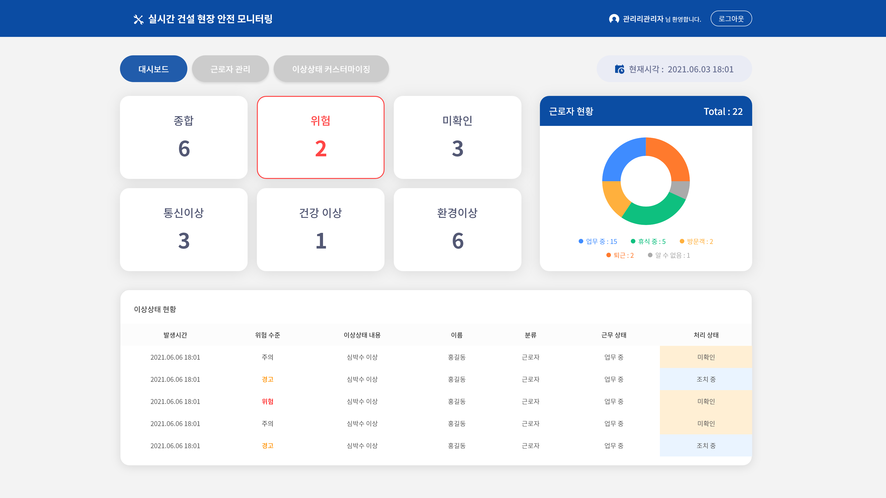
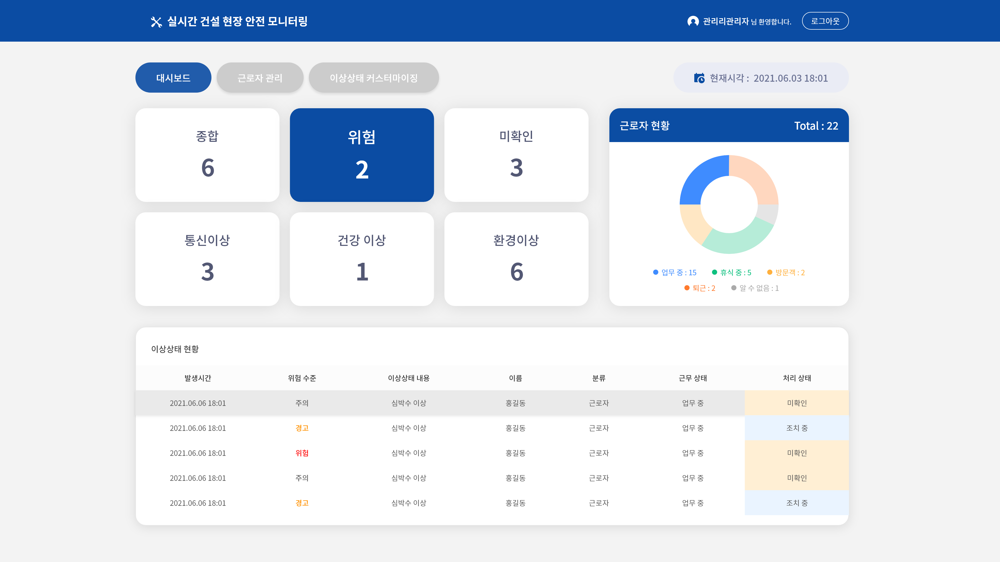
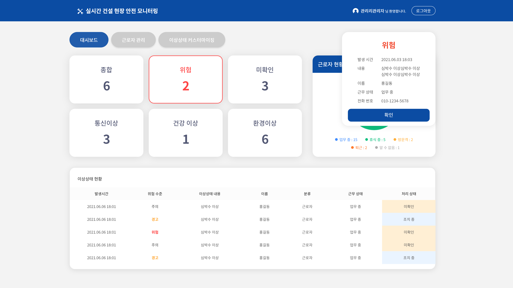
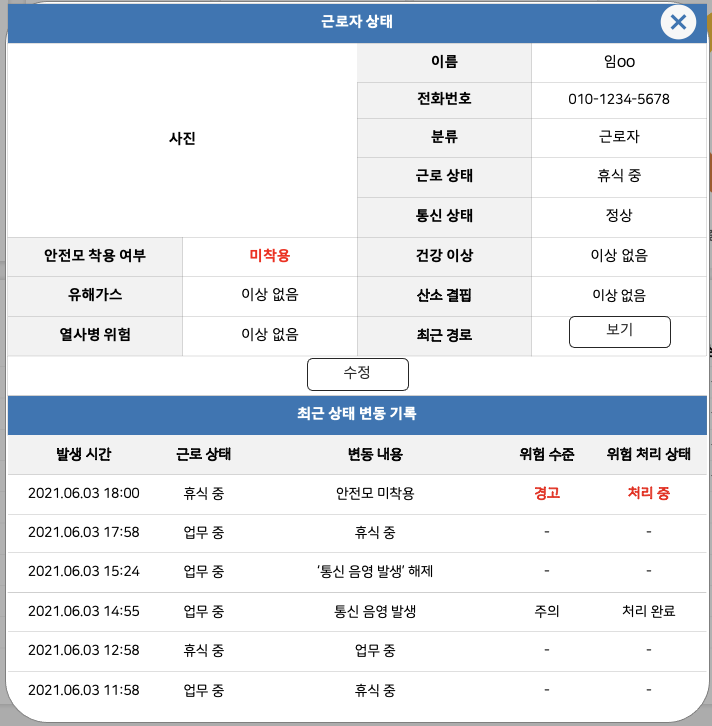
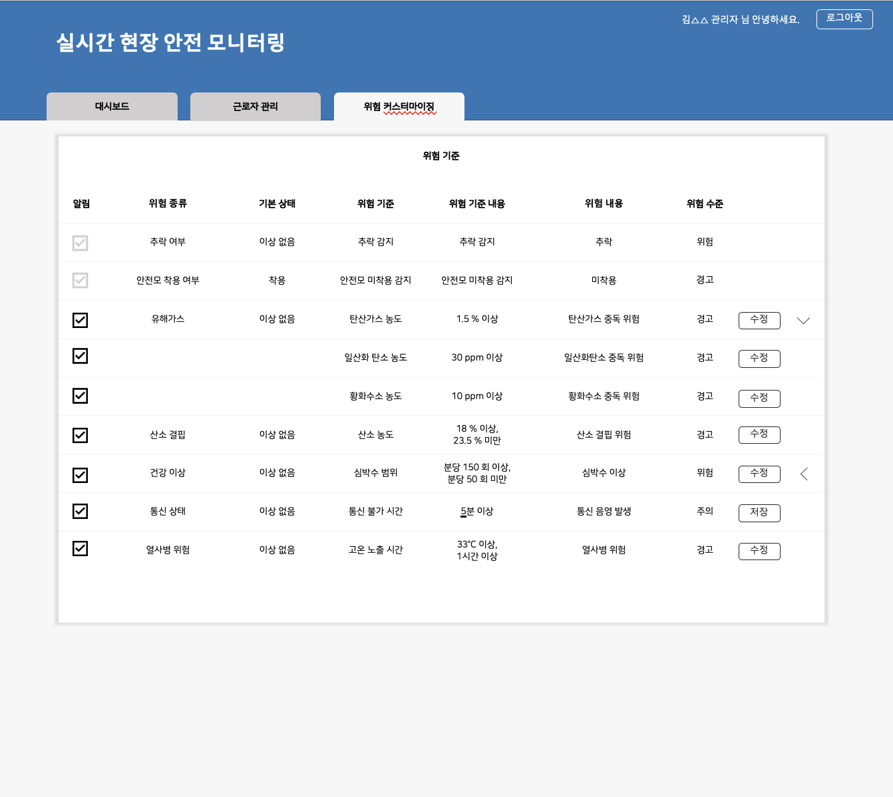

# Tutum Monitoring System
> 투툼 모니터링 시스템은 이상상태 및 근로자 관리 기능을 통해 관리자의 안전관리 지원한다.

---
# 🛠 Tech Stack - 기술 스택

## 💻 React

> Front-End 프레임워크. 생태계가 넓어 다양한 라이브러리를 제공한다는 것이 특징.

## 💻 Typescript

> 안정적인 개발을 위한 사용.

---
# 📜 View - 화면

## 이상상태 모니터링 (개발 중)

 실시간 이상상태 현황을 제공하는 모니터링 화면

 실시간 이상상태 종합 현황, 근로자 현황, 개별 이상상태 현황 정보 등을 제공함

## 신규 이상상태 알림 (개발 중)

 신규 이상상태 발생 시 이상상태와 해당 근로자에 대한 정보를 팝업 형식으로 제공함.

 
## 개별 근로자 관리 (개발 전)

 개별 근로자에 대한 인적사항, 상태 현황, 위치 등을 제공함.
 
 

## 이상상태 커스터마이징 (개발 전)

이상상태 발생 기준 및 알림 활성화 여부를 직접 관리할 수 있음.

---

# ☎️  Manager - 담당자

**👩🏻‍💻**  김예슬

📧  imys0613@naver.com